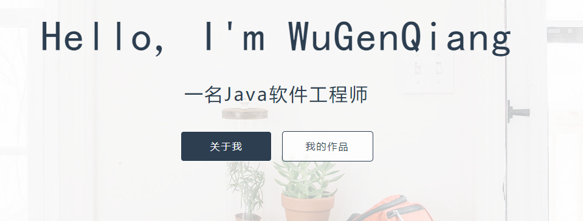

# 吴跟强的个人简历

### 介绍
**个人简历-纯静态页面，无后台**

> **预览 ➡️ [https://wugenqiang.github.io/resume/](https://wugenqiang.github.io/resume/)**

**一直在努力,从未放弃**
> 不浮躁，不偏激，不守旧，爱编程，爱后端，爱新技术，爱运动，爱旅行，执行力和学习能力都棒棒哒！

# 简介
- [个人博客](https://wugenqiang.github.io/)
- [GitHub](https://github.com/wugenqiang)
- [码云](https://gitee.com/wugenqiang)
- [CSDN](https://blog.csdn.net/wugenqiang)
- **主要涉及技术：`Java后端开发`、`公众号开发`、`开源爱好者`、`Linux`**